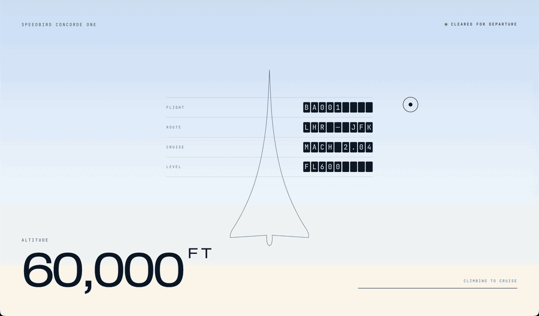

# Concorde

A single-page site about the history of Concorde, told as a flight: you scroll, the aircraft climbs, and the sky changes with altitude.



## Why

I'm a big fan of airplanes and wanted to learn more about Concorde's history. Building a page about it seemed like a good excuse to also learn something new on the technical side. This is my first time making a full 3D scroll animation, so the project is as much a learning exercise as it is a tribute to the aircraft.

## How it works

A fixed WebGL canvas sits behind the page with a sky shader, clouds, and the 3D Concorde. The DOM sections scroll over it. One number, altitude, drives the whole look: the camera path, the sky colours, and the theme flips from light to dark as you climb.

Built with Next.js, React, Tailwind, GSAP, Lenis, and React Three Fiber.

## Running it

```bash
npm install
npm run dev
```

Then open [http://localhost:3000](http://localhost:3000).

## Attribution

The 3D aircraft is based on ["Concorde 3D Model"](https://sketchfab.com/3d-models/concorde-3d-model-d2222f34152d4850afff0124872fc9ba) by [thomas333](https://sketchfab.com/thomas333), licensed under [CC-BY-4.0](http://creativecommons.org/licenses/by/4.0/). Photographs are from Wikimedia Commons contributors under their respective licences (see `content/photos.ts`).
